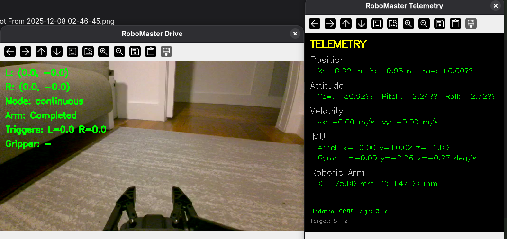

# RoboMaster Playground

A playground for DJI RoboMaster robot experimentation, including simulation, CLI control, and joystick support. This project provides tools for controlling RoboMaster robots, simulating movement, and experimenting with mecanum wheel kinematics.



## Features

- **CLI Interface**: Command-line tools for robot control (`robomaster` command)
- **Joystick Control**: Drive your robot with Xbox/PS5 controllers
- **Command Recording**: Record joystick sessions for replay
- **Real-time Telemetry**: Live sensor data display (position, velocity, arm, gripper)
- **Simulation Mode**: Test controls without a physical robot
- **Video Streaming**: Live video feed from robot camera
- **Robot Info**: Query battery, sensors, arm status
- **Track Simulation**: Visualize robot movement patterns using pygame

## Prerequisites

- **Python 3.10 or 3.11** (required for LeRobot compatibility)
- DJI RoboMaster EP/S1 robot (for physical robot control)
- WiFi connection to the robot (for physical robot control)
- FFmpeg development libraries (for video decoding)
- USB game controller (for joystick control)

> **📖 For detailed step-by-step installation instructions, see [INSTALL.md](INSTALL.md)**

## Installation

### System Dependencies

```bash
# Ubuntu/Debian
sudo apt-get install cmake libopus-dev libavcodec-dev libavformat-dev libswscale-dev python3-dev

# Arch Linux
sudo pacman -S cmake opus ffmpeg python dkms linux-headers

# macOS
brew install cmake opus ffmpeg python
```

### Forked RoboMaster SDK

This project uses a [forked RoboMaster SDK](https://github.com/tiry/RoboMaster-SDK) instead of the official DJI SDK because:

1. **Modern FFmpeg compatibility** - The official SDK uses deprecated FFmpeg APIs that don't compile with FFmpeg 5.x/6.x/7.x/8.x
2. **Python 3.10+ support** - Updated pybind11 to v2.11 for modern Python compatibility
3. **Updated cmake requirements** - Works with modern toolchains

The fork maintains full API compatibility with the official SDK while fixing build issues on modern systems.

**Fork repository:** https://github.com/tiry/RoboMaster-SDK

### Installation Steps

```bash
# Clone the repository
git clone https://github.com/tiry/RoboMaster-Playground.git
cd RoboMaster-Playground

# Create virtual environment
python -m venv venv
source venv/bin/activate  # On Windows: venv\Scripts\activate

# Install libmedia_codec from forked SDK (required for video)
git clone https://github.com/tiry/RoboMaster-SDK.git /tmp/RoboMaster-SDK
pip install /tmp/RoboMaster-SDK/lib/libmedia_codec

# Install robomaster SDK
pip install git+https://github.com/tiry/RoboMaster-SDK.git

# Install this project (includes CLI)
pip install -e .
```

### Xbox Controller Setup (Linux)

For Xbox controller support on Linux, install the xone driver:

```bash
# Install DKMS and headers
sudo pacman -S dkms linux-headers  # Arch
# or: sudo apt install dkms linux-headers-$(uname -r)  # Debian/Ubuntu

# Install xone driver
git clone https://github.com/medusalix/xone.git /tmp/xone
cd /tmp/xone && sudo ./install.sh

# Add yourself to input group
sudo usermod -aG input $USER
# Log out and back in
```

## CLI Usage

After installation, the `robomaster` command is available:

```bash
robomaster --help              # Show all commands
robomaster --version           # Show version
```

### Available Commands

| Command | Description |
|---------|-------------|
| `robomaster info` | Get robot information (version, battery, sensors) |
| `robomaster video` | Open live video stream from robot camera |
| `robomaster drive` | Drive robot with USB joystick |
| `robomaster led` | Control robot LEDs (on/off/color) |
| `robomaster control-config` | Configure and test your game controller |

### Get Robot Info

```bash
robomaster info                # Basic info with 1.5s sensor collection
robomaster info -w 3           # Wait 3 seconds for more sensor data
```

**Example output:**
```
━━━ Basic Info ━━━
📋 Version: 01.02.0000
🔢 Serial: 3JKCK7F001...

━━━ Battery ━━━
🔋 Level: 85%

━━━ Chassis ━━━
📍 Position: x=0.000m, y=0.000m, yaw=0.0°
🔄 Attitude: yaw=0.0°, pitch=0.0°, roll=0.0°
💨 Velocity: vx=0.00, vy=0.00, vz=0.00
📊 Status: static

━━━ Robotic Arm ━━━
🦾 Position: x=100.0mm, y=50.0mm

━━━ Gripper ━━━
✊ Status: (0, 0)

━━━ Distance Sensor ━━━
📏 Front: 1234 mm
📏 Right: 567 mm
📏 Back:  890 mm
📏 Left:  456 mm
```

**Displays:**
- Robot version and serial number
- Battery level
- Chassis position, attitude, velocity
- Robotic arm position (EP Engineering Robot)
- Gripper and servo status
- Distance sensor readings (front, right, back, left)

### Video Streaming

```bash
robomaster video               # BOTH cameras (robot + webcam) - default
robomaster video --robot       # Robot camera only
robomaster video --static      # USB webcam only
robomaster video --static -d 2 # USB webcam at /dev/video2
robomaster video -res 720p     # Both cameras, robot at 720p
```

Press 'q' or ESC to quit.

**Dual Camera Mode (default):**

By default, opens BOTH the robot camera and USB webcam in separate side-by-side windows. This is useful for:
- VLA training data collection (ego-view + overhead view)
- Multi-camera recording setups
- Monitoring robot from multiple angles

**Single Camera Modes:**
- `--robot`: Robot camera only (no USB webcam)
- `--static`: USB webcam only (no robot connection needed)

Configure the webcam device in `cli/config.py`:
```python
WEBCAM = {
    'device_index': 0,  # 0 = /dev/video0, 1 = /dev/video1, etc.
    'width': 640,       # Frame width
    'height': 480,      # Frame height
    'fps': 30,          # Target frame rate
}
```

Find available devices:
```bash
ls /dev/video*           # List video devices
v4l2-ctl --list-devices  # Detailed device info
```

### LED Control

Control robot LEDs from the command line:

```bash
robomaster led on              # White LEDs
robomaster led on -c red       # Red LEDs
robomaster led on -c #00FF00   # Green LEDs (hex)
robomaster led on -c "255,128,0"  # Orange (RGB)
robomaster led off             # Turn off
```

**Color formats:**
- Named: `red`, `green`, `blue`, `white`, `yellow`, `cyan`, `magenta`, `orange`, `purple`, `pink`
- Hex: `#FF0000` or `FF0000`
- RGB: `255,0,0` or `"255 0 0"`

### Joystick Control

#### 1. Configure Your Controller

First, test that your controller is detected:

```bash
robomaster control-config
```

This shows real-time axis and button values to help configure your controller.

#### 2. Drive in Simulation Mode

Test the controls without connecting to a robot:

```bash
robomaster drive --simu
```

#### 3. Drive the Real Robot

Connect to your robot's WiFi, then:

```bash
robomaster drive               # With video feed
robomaster drive --no-video    # Without video (lower latency)
robomaster drive -m step       # Discrete step mode
```

**Options:**
- `--simu`: Simulation mode (no robot connection)
- `--no-video`: Disable all video feeds (robot + webcam)
- `--no-webcam`: Disable USB webcam only (robot video still on)
- `-d N`: Webcam device index
- `-m continuous`: Real-time speed control (default)
- `-m step`: Discrete movements
- `-res 720p`: Video resolution (360p/540p/720p)
- `--record`: Record teleoperation data in LeRobot format
- `--task "desc"`: Episode task description (with --record)
- `--fps N`: Recording FPS (with --record)
- `--dry-run`: Print frame info without saving (with --record)
- `--telemetry` / `-t`: Show real-time telemetry window

**Dual Camera Mode (default):**

By default, the drive command opens BOTH robot camera and USB webcam (if available). The webcam opens gracefully - if not found, it simply skips without error:

```bash
robomaster drive                     # Robot + Webcam (default, webcam optional)
robomaster drive --no-webcam         # Robot camera only
robomaster drive --no-video          # No video at all
robomaster drive -d 2                # Use webcam at /dev/video2
```

#### Recording (LeRobot Format)

Record teleoperation data in LeRobot format for VLA training:

```bash
robomaster drive --record                    # Start recording
robomaster drive --record --task "Pick up the red cube"  # With task description
robomaster drive --record --fps 15           # Recording at 15 FPS
robomaster drive --record --dry-run          # Print frames without saving
```

**During recording:**
- Drive normally with joystick
- **Back button** = Save episode and stop recording
- **q/ESC** = Abort recording without saving

**Recording captures:**
- Robot camera frames (ego-view)
- USB webcam frames (overhead/external view)
- All commands: chassis velocity, arm position, gripper power

**LeRobot Dataset Features:**
- Normalized actions: All values normalized to [-1, 1]
- Dual video streams: `observation.images.robot` and `observation.images.top`
- Action tensor: 9-dimensional (move_x, move_y, rotate_z, gripper_open, gripper_close, arm_recenter, arm_x, arm_y, unused)

**Example workflow:**
```bash
# 1. Start recording
robomaster drive --record --task "Stack the blocks"

# 2. Perform the task with joystick

# 3. Press Back button to save episode

# Dataset saved to: ./records/robomaster_teleop/
```

**Configuration** (in `cli/config.py`):
```python
LEROBOT = {
    'dataset_root': './records',              # Dataset storage path
    'dataset_name': 'robomaster_teleop',      # Dataset name
    'default_fps': 30,                        # Recording FPS
    'default_task': 'do something with Robomaster',  # Default task
    'buffer_duration': 2.0,                   # Frame buffer size
    'robot_camera_offset': 0.0,               # Camera sync offset
    'static_camera_offset': 0.0,              # Webcam sync offset
    'action_ranges': {...},                   # Normalization ranges
}
```

**Install LeRobot:**
```bash
pip install lerobot
# Or: pip install -e ".[recording]"
```

#### Real-time Telemetry

Open a separate telemetry window showing live sensor data:

```bash
robomaster drive --telemetry        # Enable telemetry window
robomaster drive -t                 # Short form
robomaster drive -t --no-video      # Telemetry only (no video)
```

**Telemetry window displays:**
- **Position**: X, Y (meters), Yaw (degrees)
- **Attitude**: Yaw, Pitch, Roll (degrees)
- **Velocity**: vx, vy (m/s) - linear velocity
- **IMU**: Accelerometer (m/s²) and Gyroscope (deg/s) - angular velocity
- **Robotic Arm**: X, Y position (mm)

**Configuration** (in `cli/config.py`):
```python
TELEMETRY = {
    'frequency': 5,          # Hz - subscription update frequency (lower is more stable)
    'window_width': 420,     # Telemetry window width
    'window_height': 420,    # Telemetry window height
}
```

#### Controller Mapping (Xbox)

| Control | Action |
|---------|--------|
| **Left Stick** | Move robot (forward/back/strafe) - analog intensity affects speed |
| **Right Stick X** | Rotate robot - analog intensity affects speed |
| **D-pad Up** | Arm up (raise camera) |
| **D-pad Down** | Arm down (lower camera) |
| **D-pad Right** | Arm extend (X+) |
| **D-pad Left** | Arm retract (X-) |
| **Y Button** | Arm recenter (home position) |
| **X Button** | Toggle LED feedback on/off |
| **RB (Right Bumper)** | Open gripper (hold for progressive) |
| **LB (Left Bumper)** | Close gripper (hold for progressive) |
| **A Button** | Speed boost (2x) |
| **Back Button** | Save recording (with --record) |
| **Start Button** | Quit drive mode |
| **q/ESC** | Quit |

**Movement Characteristics:**
- **Analog control**: How hard you push the stick determines speed
- **Speed boost**: A button adds 2x multiplier (cumulative with stick intensity)
- **Gripper**: Hold button to progressively open/close, release to stop

**LED Feedback (on by default):**
- **OFF**: Robot not moving
- **CYAN**: Robot moving
- **RED**: Robot moving with boost (A button held)
- **X button**: Toggle LED feedback on/off

**Video Overlay:**
- Shows joystick values, arm status, gripper state
- `[BOOST]` indicator when A is pressed (yellow)

### Configuration

Edit `cli/config.py` to adjust:

- **Controller mapping**: Axis/button indices for your controller
- **Deadzone**: Ignore small stick movements (default 0.15)
- **Movement speeds**: Step sizes and max speeds
- **Arm settings**: Step sizes for arm extension/height
- **Speed boost**: Multiplier when A button is pressed (default 2x)

**Example configuration:**
```python
MOVEMENT = {
    'continuous_speed_xy': 0.3,  # m/s (normal speed)
    'continuous_speed_z': 90,    # deg/s (rotation)
    'boost_multiplier': 2.0,     # 2x speed when holding A
}

ARM = {
    'step_x': 10,  # mm per step (extend/retract)
    'step_y': 10,  # mm per step (up/down)
}
```

## Legacy Usage

### Simulation Mode (No Robot Required)

Run the track simulation:

```bash
python basic_simu/simulate_track.py
```

**Controls:**
- **Up/Down Arrow**: Change track
- **Left/Right Arrow**: Replay

### Run Pre-defined Tracks

```bash
python run_track.py
```

## Project Structure

```
RoboMaster-Playground/
├── pyproject.toml           # Project config and dependencies
├── README.md                # This file
├── cli/                     # CLI commands
│   ├── __init__.py          # CLI entry point
│   ├── config.py            # Controller and movement config
│   ├── connection.py        # Robot connection context manager
│   ├── control_config.py    # Controller configuration helper
│   ├── joystick.py          # Joystick input handling
│   ├── lerobot_recorder.py  # LeRobot dataset recorder for VLA training
│   ├── telemetry.py         # Real-time telemetry display
│   ├── drive.py             # Joystick drive command
│   ├── info.py              # Robot info command
│   ├── led.py               # LED control command
│   └── video.py             # Video stream command
├── driver/                  # Robot driver abstraction layer
│   ├── __init__.py          # Module exports
│   ├── robot_driver.py      # Abstract RobotDriver interface
│   ├── sdk_driver.py        # SDK-based implementation
│   ├── recording.py         # Recording driver wrapper
│   └── simulation.py        # Pygame simulation mode
├── basic_simu/              # Track simulation code
│   ├── simulate_track.py    # Track simulation
│   ├── sim_chassis.py       # Simulated chassis
│   └── img/                 # Robot images
└── old/                     # Legacy scripts
```

### Architecture

The driver module provides a clean abstraction for robot control:

```
cli/drive.py (CLI command)
├── cli/joystick.py (controller input)
└── driver/
    ├── robot_driver.py (abstract interface)
    │   ├── RobotDriver (ABC)
    │   ├── ActionController (action tracking)
    │   └── ChassisController, ArmController
    ├── sdk_driver.py (SDK implementation)
    │   └── SDKDriver, SDKChassisController, SDKArmController
    └── simulation.py (no-robot testing)
```

This architecture allows implementing different communication protocols (SDK, text protocol, etc.) without changing the CLI code.

## Dependencies

| Package | Purpose |
|---------|---------|
| `robomaster` | DJI RoboMaster SDK |
| `opencv-python` | Video processing |
| `pygame` | Joystick input and simulation display |
| `click` | CLI framework |
| `numpy` | Numerical computations |

## Troubleshooting

### Controller Not Detected

1. Check if user is in `input` group:
   ```bash
   groups $USER
   ```

2. Add to input group if needed:
   ```bash
   sudo usermod -aG input $USER
   # Log out and back in
   ```

3. Check for `/dev/input/js0`:
   ```bash
   ls -la /dev/input/js*
   ```

4. For Xbox: Install xone driver (see Installation)
5. For PS5: May need `hid-playstation` driver

### Connection Issues

- Ensure robot is in station mode (WiFi router mode)
- Connect to robot's WiFi network
- Robot IP is typically `192.168.2.1`

### Video Issues

- Install FFmpeg libraries (see Prerequisites)
- Try lower resolution: `robomaster video -res 360p`

## License

MIT License

## Contributing

Contributions welcome! Feel free to submit issues and pull requests.
